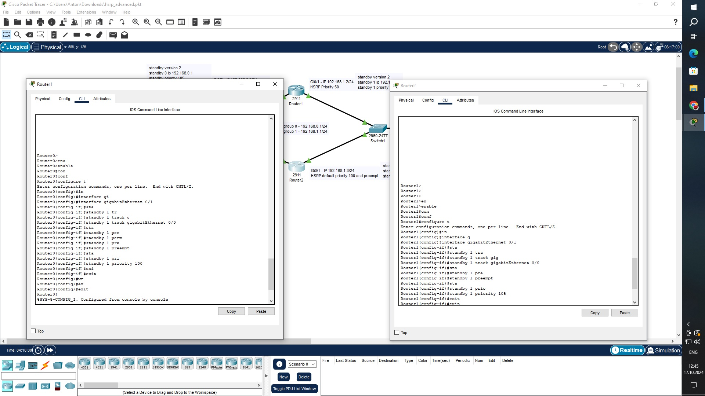
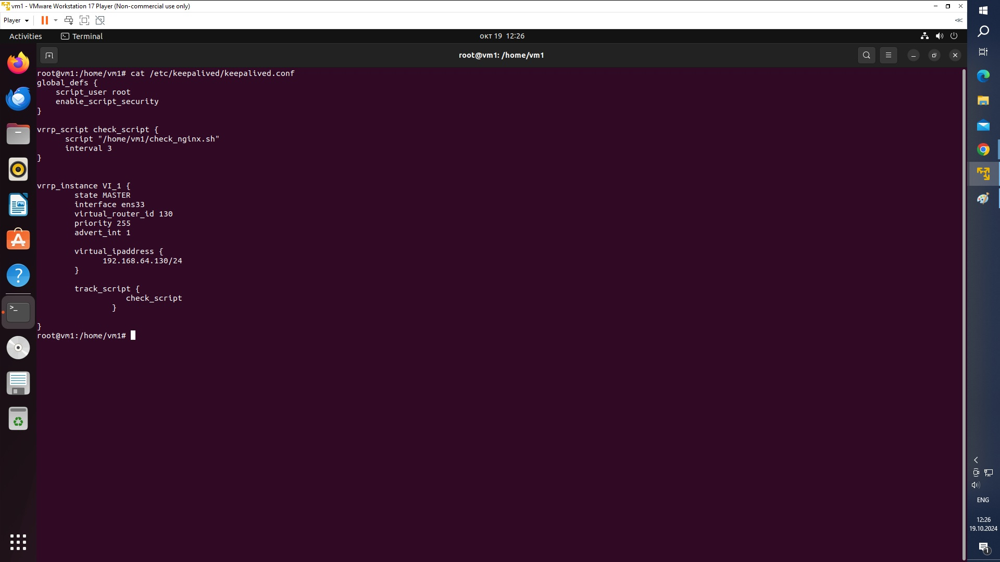

# Задание 1
Дана схема для Cisco Packet Tracer, рассматриваемая в лекции.
На данной схеме уже настроено отслеживание интерфейсов маршрутизаторов Gi0/1 (для нулевой группы)
Необходимо аналогично настроить отслеживание состояния интерфейсов Gi0/0 (для первой группы).
Для проверки корректности настройки, разорвите один из кабелей между одним из маршрутизаторов и Switch0 и запустите ping между PC0 и Server0.
На проверку отправьте получившуюся схему в формате pkt и скриншот, где виден процесс настройки маршрутизатора.

https://github.com/Anton-gen/Keepalived/blob/main/hsrp_advanced.pkt
***
# Задание 2
Запустите две виртуальные машины Linux, установите и настройте сервис Keepalived как в лекции, используя пример конфигурационного файла.
Настройте любой веб-сервер (например, nginx или simple python server) на двух виртуальных машинах
Напишите Bash-скрипт, который будет проверять доступность порта данного веб-сервера и существование файла index.html в root-директории данного веб-сервера.
Настройте Keepalived так, чтобы он запускал данный скрипт каждые 3 секунды и переносил виртуальный IP на другой сервер, если bash-скрипт завершался с кодом, отличным от нуля (то есть порт веб-сервера был недоступен или отсутствовал index.html). Используйте для этого секцию vrrp_script
На проверку отправьте получившейся bash-скрипт и конфигурационный файл keepalived, а также скриншот с демонстрацией переезда плавающего ip на другой сервер в случае недоступности порта или файла index.html
***
## Config main keepalived.conf

global_defs {
    script_user root
    enable_script_security
 }

vrrp_script check_script {
      script "/home/vm1/check_nginx.sh"
      interval 3
 }

vrrp_instance VI_1 {
        state MASTER
        interface ens33
        virtual_router_id 130
        priority 255
        advert_int 1
        
        virtual_ipaddress {
              192.168.64.130/24
        }

        track_script {
                   check_script
                }
}
 

***

## Config script check_nginx.sh
#!/bin/bash
if [[ $(netstat -tuln | grep LISTEN | grep :80) ]] && [[ -f /var/www/html/index.nginx-debian.html ]]; then
        exit 0
else
        sudo systemctl stop keepalived
fi

***
